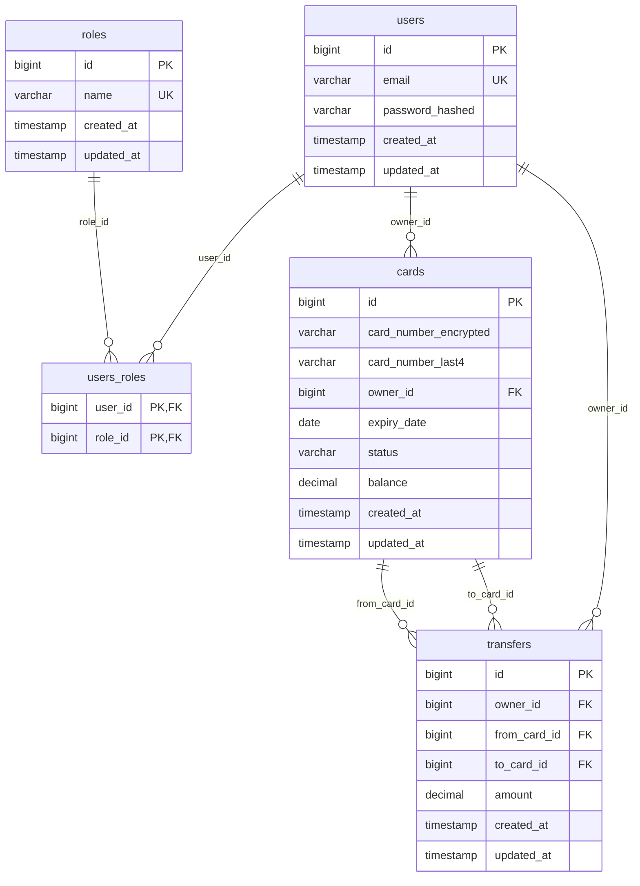

# 🏦 Система управления банковскими картами

Backend-приложение на Spring Boot для управления банковскими картами с полной поддержкой ролевой модели доступа, шифрования данных и переводов между картами.

## 🏗 Архитектура и технологии

### Технический стек
- **Java 21** + **Spring Boot 3.5.6**
- **Spring Security** + **JWT** аутентификация
- **PostgreSQL** + **Spring Data JPA**
- **Liquibase** для миграций БД
- **Docker Compose** для локальной разработки
- **Swagger/OpenAPI** для документации API
- **JUnit 5** + **Mockito** для тестирования

### Схема базы данных



### Архитектурные паттерны
- **Clean Architecture** с четкими слоями
- **Domain-Driven Design** с Value Objects
- **Repository Pattern** для доступа к данным
- **DTO Pattern** для API контрактов
- **Global Exception Handling**

## 🎯 Функциональность

### Роли пользователей

#### 👤 USER (Пользователь)
- ✅ Просмотр своих карт с пагинацией и сортировкой
- ✅ Получение баланса карт
- ✅ Переводы между собственными картами
- ✅ Просмотр истории переводов
- ✅ Обновление профиля (email, пароль)

#### 👨‍💼 ADMIN (Администратор)
- ✅ Создание карт для пользователей
- ✅ Управление статусами карт (активация/блокировка)
- ✅ Удаление карт
- ✅ Просмотр всех карт и переводов в системе
- ✅ Управление пользователями (создание/удаление)

### Безопасность данных
- 🔐 **AES-256-GCM шифрование** номеров карт
- 🎭 **Маскирование** - отображение только последних 4 цифр
- 🔑 **JWT токены** для аутентификации
- 🛡️ **BCrypt** хеширование паролей
- 🚪 **Ролевая модель доступа**

### Бизнес-логика
- ✅ Валидация номеров карт по алгоритму Луна
- ✅ Проверка достаточности средств при переводах
- ✅ Контроль состояния карт (активные/заблокированные/истекшие)
- ✅ Переводы только между картами одного владельца
- ✅ Валидация дат истечения карт

## 🚀 Быстрый старт

### Предварительные требования
- **Docker** и **Docker Compose**
- **Maven 3.8+** 
- **Java 21** (для локальной разработки)

### Запуск с Docker

1. **Клонируйте репозиторий**
```bash
git clone https://github.com/vgnapuga/effective-mobile_bankCards_test
cd bankcards
```

2. **Настройте переменные окружения**
```bash
cp .env.example .env
# Отредактируйте .env файл, установив безопасные значения
```

3. **Соберите и запустите**
```bash
# Сборка приложения
mvn clean package -DskipTests

# Запуск всех сервисов
docker-compose up -d
```
### Тестовые данные

По умолчанию в системе создаются тестовые данные для демонстрации:

#### Пользователи
| Email | Пароль | Роль | Описание |
|-------|--------|------|----------|
| `admin@test.com` | `password123` | ADMIN | Администратор системы |
| `user@test.com` | `password123` | USER | Обычный пользователь |

#### Карты
| Владелец | Последние 4 цифры | Статус | Баланс |
|----------|-------------------|---------|---------|
| `user@test.com` | 1234 | ACTIVE | 1500.00₽ |
| `user@test.com` | 5678 | ACTIVE | 750.50₽ |
| `user@test.com` | 9999 | BLOCKED | 0.00₽ |
| `admin@test.com` | 7777 | ACTIVE | 5000.00₽ |
| `admin@test.com` | 0000 | PENDING_ACTIVATION | 0.00₽ |

#### Переводы (пример)
| От карты | К карте | Сумма | Дата |
|----------|---------|-------|------|
| *1234 | *5678 | 250.00₽ | 7 дней назад |
| *5678 | *1234 | 100.00₽ | 3 дня назад |
| *1234 | *5678 | 50.50₽ | 1 день назад |

### Аутентификация

**Получение JWT токена для пользователя:**
```bash
curl -X POST http://localhost:8080/api/auth/login \
  -H "Content-Type: application/json" \
  -d '{
    "email": "user@test.com",
    "password": "password123"
  }'
```

**Получение JWT токена для администратора:**
```bash
curl -X POST http://localhost:8080/api/auth/login \
  -H "Content-Type: application/json" \
  -d '{
    "email": "admin@test.com",
    "password": "password123"
  }'
```

**Ответ:**
```json
{
  "token": "eyJhbGciOiJIUzI1NiJ9...",
  "userId": 1,
  "expiresIn": 3600000
}
```

**Использование токена в запросах:**
```bash
# Сохранить токен в переменную
export JWT_TOKEN="eyJhbGciOiJIUzI1NiJ9..."

# Использовать в заголовке Authorization
curl -H "Authorization: Bearer $JWT_TOKEN" http://localhost:8080/api/cards
```

### Основные эндпоинты

#### 🔐 Аутентификация
- `POST /api/auth/login` - Вход в систему

#### 👤 Пользователи
- `GET /api/users` - Профиль текущего пользователя
- `PUT /api/users/email` - Обновление email
- `PUT /api/users/password` - Обновление пароля

#### 💳 Карты (Пользователь)
- `GET /api/cards` - Список своих карт
- `GET /api/cards/{id}` - Получение карты по ID

#### 💳 Карты (Администратор)
- `POST /api/admin/cards` - Создание карты
- `GET /api/admin/cards` - Список всех карт
- `GET /api/admin/cards/{id}` - Карта по ID
- `PUT /api/admin/cards/activate/{id}` - Активация карты
- `PUT /api/admin/cards/block/{id}` - Блокировка карты
- `DELETE /api/admin/cards/{id}` - Удаление карты

#### 💸 Переводы
- `POST /api/transfers` - Создание перевода
- `GET /api/transfers` - История переводов пользователя
- `GET /api/transfers/{id}` - Перевод по ID

#### 👥 Управление пользователями (Администратор)
- `POST /api/admin/users` - Создание пользователя
- `GET /api/admin/users` - Список всех пользователей
- `GET /api/admin/users/{id}` - Пользователь по ID
- `DELETE /api/admin/users/{id}` - Удаление пользователя

### Пагинация и сортировка

Все списковые эндпоинты поддерживают пагинацию:

```bash
GET /api/cards?page=0&size=10&sortBy=createdAt&sortDirection=desc
```

**Параметры:**
- `page` - номер страницы (по умолчанию: 0)
- `size` - размер страницы (по умолчанию: 10)
- `sortBy` - поле для сортировки (по умолчанию: id)
- `sortDirection` - направление сортировки: asc/desc (по умолчанию: asc)

## 🔒 Безопасность

### Шифрование карт

Номера карт шифруются с использованием **AES-256-GCM**:

```java
// Пример конфигурации ключа
CARD_ENCRYPTION_KEY=base64EncodedKey256bit
```

### JWT токены

```bash
# Заголовок для авторизованных запросов
Authorization: Bearer <JWT_TOKEN>
```

**Срок действия токена:** 1 час (настраивается через `JWT_EXPIRATION`)

### Валидация данных

- **Номера карт:** 16 цифр + валидация по алгоритму Луна
- **Email:** RFC 5322 совместимый формат
- **Пароли:** минимум 8 символов
- **Суммы переводов:** положительные числа с точностью до 2 знаков

## 💡 Примеры использования

### Создание карты (Администратор)

```bash
curl -X POST http://localhost:8080/api/admin/cards \
  -H "Authorization: Bearer $JWT_TOKEN" \
  -H "Content-Type: application/json" \
  -d '{
    "cardNumber": "4532015112830366",
    "ownerId": 2,
    "expiryDate": "2026-12-01"
  }'
```

### Перевод между картами

```bash
curl -X POST http://localhost:8080/api/transfers \
  -H "Authorization: Bearer $JWT_TOKEN" \
  -H "Content-Type: application/json" \
  -d '{
    "fromCardId": 1,
    "toCardId": 2,
    "amount": 100.50
  }'
```

### Получение списка карт

```bash
curl -X GET "http://localhost:8080/api/cards?page=0&size=5" \
  -H "Authorization: Bearer $JWT_TOKEN"
```

**Ответ:**
```json
{
  "cards": [
    {
      "id": 1,
      "last4": "0366",
      "status": "ACTIVE",
      "expiryDate": "2026-12-01",
      "balance": 1500.00,
      "createdAt": "2024-01-15T10:30:00"
    }
  ],
  "totalCount": 1,
  "page": 0,
  "size": 5
}
```

## 🛠 Разработка

### Локальная разработка

```bash
# Запуск только базы данных
docker-compose up postgres -d

# Установка переменных окружения для разработки
export SPRING_PROFILES_ACTIVE=dev
export SPRING_DATASOURCE_URL=jdbc:postgresql://localhost:5433/bankcards

# Запуск приложения
mvn spring-boot:run
```
### Структура проекта

```
src/main/java/com/example/bankcards/
├── config/              # Конфигурация Spring
├── controller/          # REST контроллеры
├── dto/                 # Data Transfer Objects
├── exception/           # Кастомные исключения
├── model/               # Доменные модели
├── repository/          # Репозитории данных
├── security/            # Компоненты безопасности
├── service/             # Бизнес-логика
└── util/                # Утилиты и константы
```
### Логирование

Уровни логирования настраиваются через `application.yml`:

```yaml
logging:
  level:
    '[com.example.bankcards]': DEBUG
    '[org.springframework.security]': INFO
```

## 📈 Статус проекта

### ✅ Реализовано
- ✅ Полная ролевая модель (USER/ADMIN)
- ✅ JWT аутентификация и авторизация
- ✅ CRUD операции для карт
- ✅ Переводы между картами
- ✅ Шифрование данных карт
- ✅ Валидация по алгоритму Луна
- ✅ Пагинация и сортировка
- ✅ Global Exception Handling
- ✅ Docker развертывание
- ✅ Comprehensive тестирование