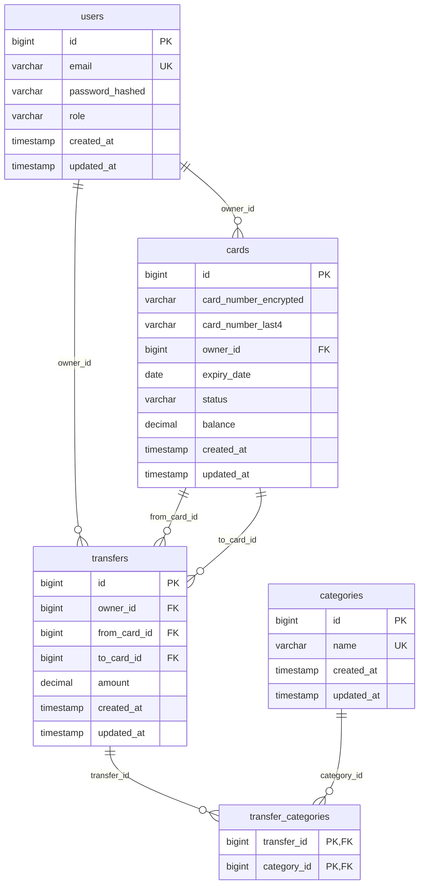

# 🏦 Bank Card Management System

**English** | [Русский](./README.md)

Spring Boot backend application for managing bank cards with full role-based access control, data encryption, and inter-card transfers.

## 🏗 Architecture & Technologies

### Tech Stack
- **Java 21** + **Spring Boot 3.5.7**
- **Spring Security** + **JWT** authentication
- **PostgreSQL** + **Spring Data JPA**
- **Liquibase** for database migrations
- **Docker Compose** for local development
- **Swagger/OpenAPI** for API documentation
- **JUnit 5** + **Mockito** for testing

### Database Schema



### Architectural Patterns
- **Clean Architecture** with clear layer separation
- **Domain-Driven Design** with Value Objects
- **Repository Pattern** for data access
- **DTO Pattern** for API contracts
- **Global Exception Handling**

## 🎯 Features

### User Roles

#### 👤 USER
- ✅ View own cards with pagination and sorting
- ✅ Get card balances
- ✅ Transfer between own cards
- ✅ View transfer history
- ✅ Update profile (email, password)

#### 👨‍💼 ADMIN
- ✅ Create cards for users
- ✅ Manage card statuses (activation/blocking)
- ✅ Delete cards
- ✅ View all cards and transfers in the system
- ✅ User management (creation/deletion)

### Data Security
- 🔐 **AES-256-GCM encryption** for card numbers
- 🎭 **Masking** - display only last 4 digits
- 🔑 **JWT tokens** for authentication
- 🛡️ **BCrypt** password hashing
- 🚪 **Role-based access control**

### Business Logic
- ✅ Card number validation using Luhn algorithm
- ✅ Sufficient funds verification for transfers
- ✅ Card status control (active/blocked/expired)
- ✅ Transfers only between cards of the same owner
- ✅ Card expiration date validation
- ✅ Transfer categorization

## 🚀 Quick Start

### Prerequisites
- **Docker** and **Docker Compose**
- **Maven 3.8+** 
- **Java 21** (for local development)

### Running with Docker

1. **Clone the repository**
```bash
git clone https://github.com/vgnapuga/effective-mobile_bankCards_test
cd bankcards
```

2. **Configure environment variables**
```bash
cp .env.example .env
# Edit the .env file and set secure values
```

3. **Build and run**
```bash
# Build the application
mvn clean package -DskipTests

# Start all services
docker-compose up -d
```

### Test Data

The system creates test data by default for demonstration purposes:

#### Users
| Email | Password | Role | Description |
|-------|----------|------|-------------|
| `admin@test.com` | `password123` | ADMIN | System administrator |
| `user@test.com` | `password123` | USER | Regular user |

#### Cards
| Owner | Last 4 digits | Status | Balance |
|-------|---------------|--------|---------|
| `user@test.com` | 1234 | ACTIVE | $1500.00 |
| `user@test.com` | 5678 | ACTIVE | $750.50 |
| `user@test.com` | 9999 | BLOCKED | $0.00 |
| `admin@test.com` | 7777 | ACTIVE | $5000.00 |
| `admin@test.com` | 0000 | PENDING_ACTIVATION | $0.00 |

#### Transfers (examples)
| From card | To card | Amount | Date |
|-----------|---------|--------|------|
| *1234 | *5678 | $250.00 | 7 days ago |
| *5678 | *1234 | $100.00 | 3 days ago |
| *1234 | *5678 | $50.50 | 1 day ago |

#### Transfer Categories
- `SAVINGS` - Savings
- `SALARY` - Salary
- `INVESTMENTS` - Investments
- `VACATION` - Vacation
- `OTHER` - Other

### Authentication

**Get JWT token for user:**
```bash
curl -X POST http://localhost:8080/api/auth/login \
  -H "Content-Type: application/json" \
  -d '{
    "email": "user@test.com",
    "password": "password123"
  }'
```

**Get JWT token for admin:**
```bash
curl -X POST http://localhost:8080/api/auth/login \
  -H "Content-Type: application/json" \
  -d '{
    "email": "admin@test.com",
    "password": "password123"
  }'
```

**Response:**
```json
{
  "token": "eyJhbGciOiJIUzI1NiJ9...",
  "userId": 1,
  "expiresIn": 3600000
}
```

**Using token in requests:**
```bash
# Save token to variable
export JWT_TOKEN="eyJhbGciOiJIUzI1NiJ9..."

# Use in Authorization header
curl -H "Authorization: Bearer $JWT_TOKEN" http://localhost:8080/api/cards
```

### Main Endpoints

#### 🔐 Authentication
- `POST /api/auth/login` - Login

#### 👤 Users
- `GET /api/users` - Current user profile
- `PUT /api/users/email` - Update email
- `PUT /api/users/password` - Update password

#### 💳 Cards (User)
- `GET /api/cards` - List own cards
- `GET /api/cards/{id}` - Get card by ID

#### 💳 Cards (Admin)
- `POST /api/admin/cards` - Create card
- `GET /api/admin/cards` - List all cards
- `GET /api/admin/cards/{id}` - Get card by ID
- `PUT /api/admin/cards/activate/{id}` - Activate card
- `PUT /api/admin/cards/block/{id}` - Block card
- `DELETE /api/admin/cards/{id}` - Delete card

#### 💸 Transfers
- `POST /api/transfers` - Create transfer
- `GET /api/transfers` - User transfer history
- `GET /api/transfers/{id}` - Get transfer by ID

#### 📊 Transfers (Admin)
- `GET /api/admin/transfers` - List all transfers
- `GET /api/admin/transfers/{id}` - Get transfer by ID

#### 👥 User Management (Admin)
- `POST /api/admin/users` - Create user
- `GET /api/admin/users` - List all users
- `GET /api/admin/users/{id}` - Get user by ID
- `DELETE /api/admin/users/{id}` - Delete user

### Pagination and Sorting

All list endpoints support pagination:

```bash
GET /api/cards?page=0&size=10&sortBy=createdAt&sortDirection=desc
```

**Parameters:**
- `page` - page number (default: 0)
- `size` - page size (default: 10)
- `sortBy` - field to sort by (default: id)
- `sortDirection` - sort direction: asc/desc (default: asc)

## 🔒 Security

### Card Encryption

Card numbers are encrypted using **AES-256-GCM**:

```java
// Example key configuration
CARD_ENCRYPTION_KEY=base64EncodedKey256bit
```

### JWT Tokens

```bash
# Header for authorized requests
Authorization: Bearer <JWT_TOKEN>
```

**Token expiration:** 1 hour (configurable via `JWT_EXPIRATION`)

### Data Validation

- **Card numbers:** 16 digits + Luhn algorithm validation
- **Email:** RFC 5322 compliant format
- **Passwords:** minimum 8 characters
- **Transfer amounts:** positive numbers with 2 decimal places precision

## 💡 Usage Examples

### Create Card (Admin)

```bash
curl -X POST http://localhost:8080/api/admin/cards \
  -H "Authorization: Bearer $JWT_TOKEN" \
  -H "Content-Type: application/json" \
  -d '{
    "cardNumber": "4532015112830366",
    "ownerId": 2,
    "expiryDate": "2026-12-01"
  }'
```

### Transfer Between Cards

```bash
curl -X POST http://localhost:8080/api/transfers \
  -H "Authorization: Bearer $JWT_TOKEN" \
  -H "Content-Type: application/json" \
  -d '{
    "fromCardId": 1,
    "toCardId": 2,
    "amount": 100.50,
    "categoryIds": [1, 2]
  }'
```

### Get Card List

```bash
curl -X GET "http://localhost:8080/api/cards?page=0&size=5" \
  -H "Authorization: Bearer $JWT_TOKEN"
```

**Response:**
```json
{
  "cards": [
    {
      "id": 1,
      "last4": "0366",
      "status": "ACTIVE",
      "expiryDate": "2026-12-01",
      "balance": 1500.00,
      "createdAt": "2024-01-15T10:30:00"
    }
  ],
  "totalCount": 1,
  "page": 0,
  "size": 5
}
```

## 🛠 Development

### Local Development

```bash
# Run only database
docker-compose up postgres -d

# Set environment variables for development
export SPRING_PROFILES_ACTIVE=dev
export SPRING_DATASOURCE_URL=jdbc:postgresql://localhost:5433/bankcards

# Run application
mvn spring-boot:run
```

### Project Structure

```
src/main/java/com/example/bankcards/
├── config/              # Spring configuration
├── controller/          # REST controllers
├── dto/                 # Data Transfer Objects
├── exception/           # Custom exceptions
├── model/               # Domain models
├── repository/          # Data repositories
├── security/            # Security components
├── service/             # Business logic
└── util/                # Utilities and constants
```

### Logging

Logging levels are configured in `application.yml`:

```yaml
logging:
  level:
    '[com.example.bankcards]': DEBUG
    '[org.springframework.security]': INFO
```

## 📈 Project Status

### ✅ Implemented
- ✅ Complete role model (USER/ADMIN)
- ✅ JWT authentication and authorization
- ✅ CRUD operations for cards
- ✅ Inter-card transfers
- ✅ Card data encryption
- ✅ Luhn algorithm validation
- ✅ Pagination and sorting
- ✅ Global exception handling
- ✅ Docker deployment
- ✅ Comprehensive testing
- ✅ Transfer categorization